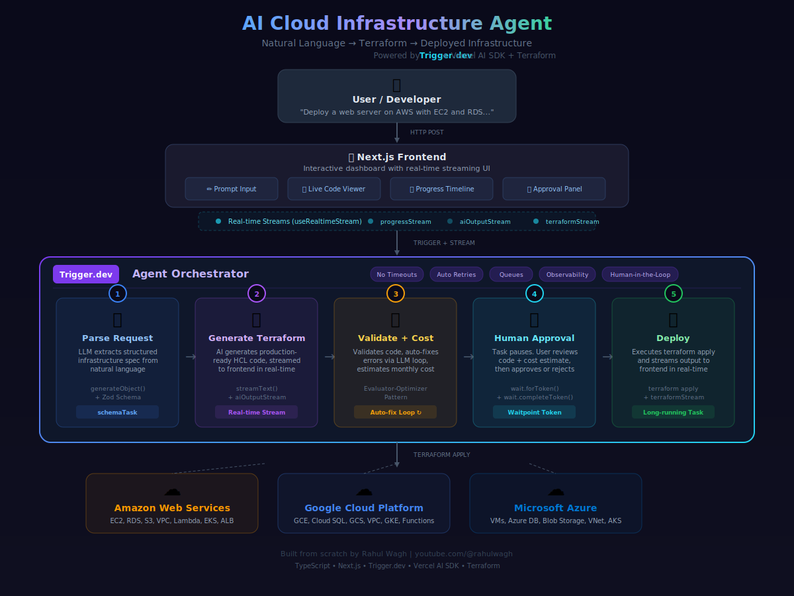

# AI Cloud Infrastructure Agent

Deploy cloud infrastructure using natural language. An AI agent that parses your request, generates Terraform code, validates it, estimates cost, and deploys it - all powered by [Trigger.dev](https://trigger.dev).

---

## Architecture

### Overview

<p align="center">
  
</p>

### High-Level Architecture

Shows all layers of the system: User, Frontend, Trigger.dev Orchestration, AI Engine, and Cloud Providers with the data flow between them.

<p align="center">
  
</p>

### Orchestrator Pipeline

The 5-step sequential workflow inside Trigger.dev using `triggerAndWait()`, including the data transformation pipeline and real-time stream events.

<p align="center">
  
</p>

### API Sequence Flow

Complete sequence diagram showing every HTTP request, Trigger.dev task call, AI API call, and stream event in order across all 6 swimlanes.

<p align="center">
  
</p>

### Interactive Diagrams

For animated, interactive versions of these diagrams, open the HTML files in your browser:

- [`architecture-diagram.html`](architecture-diagram.html) - Full CSS-based architecture with hover effects
- [`diagrams/01-high-level-architecture.html`](diagrams/01-high-level-architecture.html) - Animated data flow lines
- [`diagrams/02-orchestrator-pipeline.html`](diagrams/02-orchestrator-pipeline.html) - Animated pipeline with glowing effects
- [`diagrams/03-api-sequence-flow.html`](diagrams/03-api-sequence-flow.html) - Animated sequence flow

### Component Deep Dives

Detailed diagrams for each of the 5 pipeline steps, showing internal data flow, AI calls, streams, and retry logic.

#### Component 1: AI Request Parser

Parses natural language into a structured `InfrastructureRequest` using `generateObject()` with Zod schema validation.

<p align="center">
  
</p>

[View interactive version](diagrams/component1-ai-parser.html)

#### Component 2: Terraform Code Generator

Generates production-ready Terraform HCL via `streamText()` with real-time code streaming to the frontend.

<p align="center">
  
</p>

[View interactive version](diagrams/component2-terraform-generator.html)

#### Component 3: Validator & Auto-Fix Loop

Self-healing evaluator-optimizer pattern: validates → fixes → re-validates (up to 3 attempts) → estimates cost.

<p align="center">
  
</p>

[View interactive version](diagrams/component3-validator-autofix.html)

#### Component 4: Human-in-the-Loop Approval

Task pauses with `wait.forToken()` consuming zero compute, resumes when user approves or rejects via the frontend.

<p align="center">
  
</p>

[View interactive version](diagrams/component4-human-approval.html)

#### Component 5: Terraform Deployer

Writes `main.tf`, runs `terraform init` and `terraform apply`, streaming all output in real-time.

<p align="center">
  
</p>

[View interactive version](diagrams/component5-deployer.html)

---

## Project Structure

| File | Purpose |
|------|---------|
| `src/trigger/orchestrator.ts` | Main agent - chains all tasks together |
| `src/trigger/parse-request.ts` | AI parses natural language to structured spec |
| `src/trigger/generate-terraform.ts` | AI generates Terraform, streams code in real-time |
| `src/trigger/validate-terraform.ts` | Validates + auto-fixes + estimates cost |
| `src/streams/index.ts` | 3 real-time streams (progress, AI output, terraform) |
| `src/app/components/AgentDashboard.tsx` | Main UI with prompt input + example prompts |
| `src/app/components/ProgressTimeline.tsx` | Real-time step-by-step progress display |
| `src/app/components/TerraformViewer.tsx` | Live-streaming Terraform code viewer |
| `src/app/components/ApprovalPanel.tsx` | Human-in-the-loop approve/reject with cost display |
| `src/app/api/agent/route.ts` | API to trigger the agent |
| `src/app/api/approve/route.ts` | API to approve/reject deployment |
| `src/lib/prompts.ts` | All AI system prompts (parser, generator, validator, fixer) |
| `src/lib/schemas.ts` | Zod schemas for type safety |

---

## Trigger.dev Features Showcased

- **Long-running tasks** - no timeouts, unlike AWS Lambda or Vercel serverless
- **`triggerAndWait`** - task chaining for multi-step orchestration
- **Real-time streaming** - via `streams.define` + `useRealtimeStream` React hooks
- **Human-in-the-loop** - `wait.forToken()` pauses the task until user approves
- **Automatic retries** - exponential backoff for flaky cloud API calls
- **Evaluator-optimizer pattern** - auto-fix invalid Terraform code via LLM loop

---

## Getting Started

### Prerequisites

- Node.js 18+
- A [Trigger.dev](https://cloud.trigger.dev) account (free tier available)
- A Google Gemini API key (free tier available at [aistudio.google.com](https://aistudio.google.com/apikey))
- Cloud provider credentials (AWS/GCP/Azure) for actual deployments

### Setup

```bash
# 1. Install dependencies
cd ai-infra-agent
npm install

# 2. Initialize Trigger.dev (connects to your project)
npx trigger.dev@latest init

# 3. Configure environment variables
cp .env.example .env
# Edit .env and add your API keys

# 4. Start the Next.js dev server
npm run dev

# 5. In a separate terminal, start the Trigger.dev worker
npx trigger.dev@latest dev
```

### Environment Variables

Copy `.env.example` to `.env` and fill in:

| Variable | Required | Description |
|----------|----------|-------------|
| `TRIGGER_SECRET_KEY` | Yes | Your Trigger.dev secret key from the dashboard |
| `GOOGLE_GENERATIVE_AI_API_KEY` | Yes | Google Gemini API key from [aistudio.google.com](https://aistudio.google.com/apikey) |
| `AWS_ACCESS_KEY_ID` | For AWS | AWS credentials for terraform apply |
| `AWS_SECRET_ACCESS_KEY` | For AWS | AWS credentials for terraform apply |
| `GOOGLE_APPLICATION_CREDENTIALS` | For GCP | Path to GCP service account JSON |
| `ARM_CLIENT_ID` | For Azure | Azure service principal credentials |

---

## How It Works

### Step 1: Parse Request
The user types a natural language prompt like *"Deploy a web app on AWS with EC2, RDS PostgreSQL, and S3"*. The LLM parses this into a structured `InfrastructureRequest` object using `generateObject()` with a Zod schema for type safety.

### Step 2: Generate Terraform
Using the parsed spec, a second LLM call generates production-ready Terraform HCL code. The code is **streamed in real-time** to the frontend using Trigger.dev's `streams.define` API, so users see the code appearing live.

### Step 3: Validate + Estimate Cost
The generated code is validated for syntax and best practices. If errors are found, the **evaluator-optimizer pattern** kicks in - the LLM automatically fixes the errors and re-validates (up to 3 attempts). A cost estimate is also generated.

### Step 4: Human Approval
The Trigger.dev task **pauses** using `wait.forToken()`. The frontend displays the generated Terraform code and cost estimate with Approve/Reject buttons. When the user clicks a button, the API calls `wait.completeToken()` to resume the task.

### Step 5: Deploy
If approved, `terraform apply` is executed (simulated in demo mode for safety). The terraform output is streamed in real-time to the frontend.

---

## Video Content

See `VIDEO_OUTLINE.md` for the complete video plan including:
- Video title options
- 35-minute structured outline with timestamps
- Community post draft
- Key Trigger.dev talking points
- Thumbnail ideas

---

## Tech Stack

- **[Trigger.dev](https://trigger.dev)** - AI agent orchestration, long-running tasks, real-time streaming
- **[Next.js](https://nextjs.org)** - React framework for the frontend and API routes
- **[Vercel AI SDK](https://sdk.vercel.ai)** - `generateObject()` and `streamText()` for LLM calls
- **[Google Gemini 2.0 Flash](https://ai.google.dev)** - LLM for parsing, code generation, and validation
- **[Zod](https://zod.dev)** - Runtime schema validation for type safety
- **[Terraform](https://terraform.io)** - Infrastructure as Code for cloud deployments

---

## References

- [Trigger.dev Documentation](https://trigger.dev/docs/introduction)
- [Trigger.dev AI Agents](https://trigger.dev/product/ai-agents)
- [Building AI Agents with Trigger.dev](https://trigger.dev/blog/ai-agents-with-trigger)
- [OpenAI Agents SDK + Trigger.dev Examples](https://trigger.dev/docs/guides/example-projects/openai-agents-sdk-typescript-playground)
- [Trigger.dev Streams API](https://trigger.dev/docs/tasks/streams)
